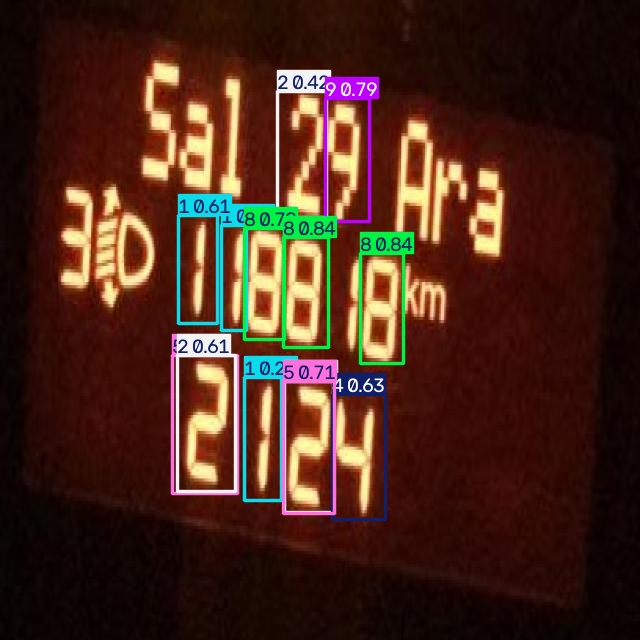

# AI-Based Vehicle Speedometer Testing System

## Overview
This project uses YOLOv8 and OCR techniques to detect and validate vehicle speedometer readings from images.

## Features
- Speedometer digit detection using YOLOv8
- OCR-based reading extraction
- Automated speed validation
- Custom-trained object detection model

## Technologies Used
- Python
- YOLOv8
- OpenCV
- EasyOCR
- NumPy

## Dataset
Custom annotated speedometer dataset containing digits 0–9.

## Results

| Metric | Score |
|----------|----------|
| Precision | 0.61 |
| Recall | 0.88 |
| mAP@50 | 0.71 |
| mAP@50-95 | 0.46 |

## Sample Detection

## Future Improvements
- Real-time video support
- Improved OCR accuracy
- Dashboard integration
